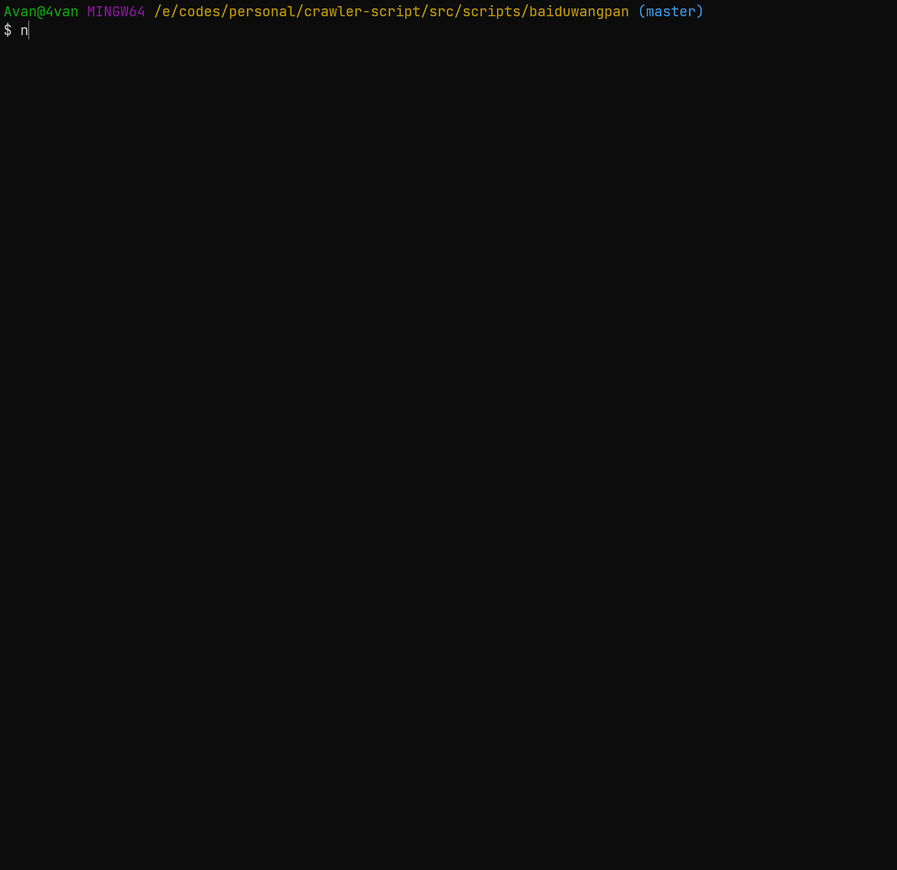

# 百度网盘



## 功能

1. 获取指定路径的所有文件信息
2. 查账文件
3. 统计没有添加序号前缀和序号不连续的文件名

## 使用方式

```bash
npx ts-node index.ts
```

## 配置

运行程序自动在家目录创建 `crawler-script/config.json` 存储配置文件

```json
{
  "cookie": "",
  "customFindPath": ""
}
```
